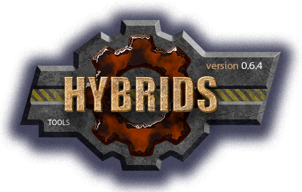

[](../../docs.md "documentation") 

[M]: ../date.md        "родитель"
[P]: ../../icons/progress.png  "в процессе..."
[S]: ../../icons/success.png   "ошибок не обнаружено"
[E]: ../../icons/empty.png     "нет данных"

[![P]][M] date/elapsed v0.0.1
============================
Класс `Elapsed` не имеет зависимостей.  
Возвращает человеко-читабельное описание длительности  

Пример использования:  

```vbs
dim mark: set mark = new Elapsed
WScript.sleep 1333 'ms
WScript.Echo "delay = " & mark.value() & " (expected: 1 sec 333 ms)"
```

Вывод в консоль:
```
delay = 1 sec 330 ms (expected: 1 sec 333 ms)
```

--------------------------------------------------------------------------------

История изменений 
-----------------

| **ID** |      версия     |    дата    | время |     ветка      | status  | продукт |  
|:------:|:---------------:|:----------:|:-----:|:--------------:|:-------:|:-------:|  
|  0003  | 0.0.1 [![P]][M] | 2024-09-26 | 19:00 | [#53-dev-date] | VERSION |  0.0.1  |  
|  0002  | 0.0.1 [![P]][M] | 2024-09-26 | 18:50 | [#53-dev-date] |  DONE   |  0.0.1  |  
|  0001  | 0.0.1 [![E]][M] | 2024-09-25 | 11:00 | [#53-dev-date] |  BEGIN  |  0.0.1  |  

*ПРИМЕЧАНИЕ:* под продуктом подразумевается версия `date/elapsed.vbs`  

[#53-dev-date]:  ../../history.md#-v053-dev
