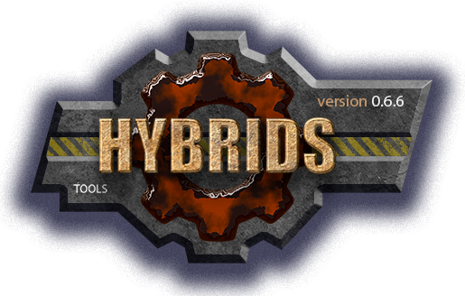

 

[M]: ../docs.md        "родитель"
[P]: ../icons/progress.png  "в процессе..."
[S]: ../icons/success.png   "ошибок не обнаружено"
[E]: ../icons/empty.png     "нет данных"

[delete]:  dir/delete.md
[isEmpty]: dir/empty.md
[make]:    dir/make.md
[move]:    dir/move.md

[![P]][M] dir v0.0.1
====================
Инструменты для работы с каталогамии:  
  - [delete]  
  - [isEmpty]  
  - [make]  
  - [move]  

--------------------------------------------------------------------------------

История изменений 
-----------------

| **ID** |      версия     |    дата    | время |      ветка      | status  | продукт |  
|:------:|:---------------:|:----------:|:-----:|:---------------:|:-------:|:-------:|  
|  0003  | 0.0.1 [![P]][M] | 2024-12-24 | 19:00 | [#60-dev-dir]   | VERSION |  0.4.2  |  
|  0002  | 0.0.1 [![P]][M] | 2024-12-24 | 18:50 | [#60-dev-dir]   |  DONE   |  0.4.2  |  
|  0001  | 0.0.1 [![E]][M] | 2024-12-24 | 11:00 | [#60-dev-dir]   |  BEGIN  |  0.4.2  |  

*ПРИМЕЧАНИЕ:* под продуктом подразумевается версия `vbs.ver`  

[#60-dev-dir]: ../history.md#-v060-dev
