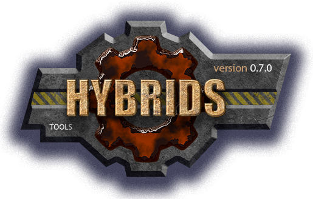

[](../../docs.md "documentation") 

[M]: ../../docs.md        "родитель"
[P]: ../../icons/progress.png  "в процессе..."
[S]: ../../icons/success.png   "ошибок не обнаружено"
[E]: ../../icons/empty.png     "нет данных"

[![S]][M] ready/duration v0.0.1
==============================
Гибрид предназначен для актуализации данных о длительности выполнения задач  
Скрипт рекурсивно обходит рабочий каталог проекта и находит в нем маркдаун-файлы
В этих файлах находит строки вида:  
```
[2026-02-19][08:57 - 14:46][5 часов, 49 мин]  
  - гибрид: `duration.bat`  
<br/>
```

Первый элемент: `[2026-02-19]` - это дата старта задачи  
Второй элемент: `[08:57 - 14:46]` - время старта и время окончания задачи  
Третий элемент: `[5 часов, 49 мин]` - длительность задачи.  

Третья группа скобок обязательна: скрипт обновляет уже существующее значение длительности,
но не добавляет его в строки вида `[2026-02-19][08:57 - 14:46]`.  

Скрипт автоматически находит подобные элементы в файлах,
и актуализирует значение длительности.  

Таким образом, скрипт избавляет от необходимости вычислять длительность задачи вручную.  
<br/>


Пример использования
--------------------
Копируем файл:  
  - откуда: `dev\duration.bat`  
  - куда: `C:\Users\idrisov\journal\!bat\duration.bat`  

Запускаем файл: `C:\Users\idrisov\journal\!bat\duration.bat`  
Дальше скрипт все сделает автоматически.  
Если где-то будут битые элементы, то скрипт покажет предупреждение.  

Рабочий каталог задается переменной `eDIR_WORK` или текущим каталогом запуска.
От рабочего каталога скрипт поднимается вверх до ближайшего файла `project.root`,
после чего рекурсивно сканирует найденный корень проекта.  

Если время окончания меньше времени старта, скрипт выводит предупреждение `(beg > end)`
и записывает отрицательную длительность. Переход через полночь автоматически не обрабатывается.  
<br/>

Управляющие параметры
---------------------

|   переменная   | значение по умолчанию |                       назначение                       |
|:--------------:|:---------------------:|:-------------------------------------------------------|
| eDEBUG         |                       | вкл/выкл отладочный вывод (`ON`)                       |
| eDIR_WORK      | текущий каталог       | задает рабочий каталог                                 |
| INCLUDE_SCAN   |                       | маски путей, которые нужно сканировать                 |
| EXCLUDE_SCAN   | `_*`                  | маски путей, которые нужно пропускать при сканировании |
| INCLUDE_FILES  | `????-??-*.md`        | маски файлов для обработки                             |
| EXCLUDE_FILES  | `_*`                  | маски файлов, которые нужно исключить                  |
| INCLUDE_DIRS   |                       | маски каталогов для обработки                          |
| EXCLUDE_DIRS   | `_*`                  | маски каталогов, которые нужно исключить               |

```bat
set "eDEBUG=ON"
set "eDIR_WORK=."
set "INCLUDE_FILES=????-??-*.md"
set "EXCLUDE_DIRS=_*;.git;.vs"
```
<br/>


История изменений 
-----------------

| **ID** |      версия     |    дата    | время |        ветка      | status  | продукт |  
|:------:|:---------------:|:----------:|:-----:|:-----------------:|:-------:|:-------:|  
|  0003  | 0.0.1 [![S]][M] | 2026-02-19 | 14:30 | [#68-dev-duration] | VERSION |  0.0.1 |  
|  0002  | 0.0.1 [![S]][M] | 2026-02-19 | 14:20 | [#68-dev-duration] |  DONE   |  0.0.1 |  
|  0001  | 0.0.1 [![E]][M] | 2026-02-19 | 09:00 | [#68-dev-duration] |  BEGIN  |  0.0.1 |  

*ПРИМЕЧАНИЕ:* под продуктом подразумевается версия `ready/duration.bat`  

[#68-dev-duration]: ../../history.md#-v068-dev
