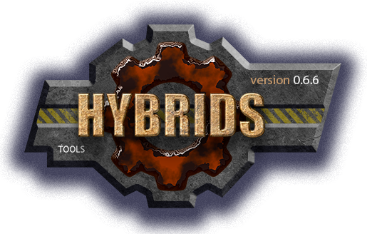

[](../docs.md "documentation") 

[M]: ../docs.md        "родитель"
[P]: ../icons/progress.png  "в процессе..."
[S]: ../icons/success.png   "ошибок не обнаружено"
[E]: ../icons/empty.png     "нет данных"

[![P]][M] unquote v0.0.1
==========================
Инструмент служит для удаления обрамляющих кавычек  
Например:  

```vbs

  dim text: text = chr(34) & "text" & chr(34)


  WScript.Echo unquote("text")   ' text
  WScript.Echo twoDigits(text)   ' text
```
--------------------------------------------------------------------------------

История изменений 
-----------------

| **ID** |      версия     |    дата    | время |      ветка     | status  | продукт |  
|:------:|:---------------:|:----------:|:-----:|:--------------:|:-------:|:-------:|  
|  0003  | 0.0.1 [![P]][M] | 2026-01-28 | 18:10 | [#66-dev-util] | VERSION |  0.0.1  |  
|  0002  | 0.0.1 [![P]][M] | 2026-01-28 | 18:00 | [#66-dev-util] |  DONE   |  0.0.1  |  
|  0001  | 0.0.1 [![E]][M] | 2026-01-28 | 17:30 | [#66-dev-util] |  BEGIN  |  0.0.1  |  

*ПРИМЕЧАНИЕ:* под продуктом подразумевается версия `unquote.vbs`  

[#66-dev-util]: ../history.md#-v066-dev
